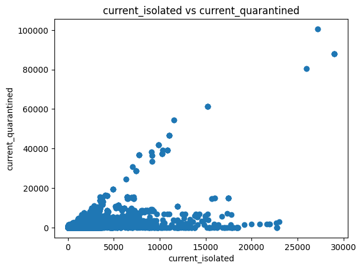
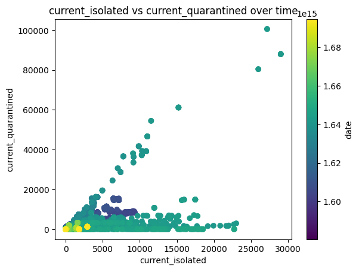

# Task 2

* What was your initial question or idea?
* How did you proceed to arrive at an answer?
* What are your results?
* Include code-snippets, plots, and similar to support your answer.

**How does the number of people in isolation scale compared to the number of people in quarantine?**
The more people in quarantine there are, the more people I would expect to be in isolation.

**First, I plotted the two columns in relation to one another**
I observed that the data is divided into two lines, so I wondered if I could get a better view by color-coding the datapoints by time.

```python
# plot with current_isolated in relation with current_quarantined
import matplotlib.pyplot as plt
plt.scatter(covid_data['current_isolated'], covid_data['current_quarantined'])
plt.xlabel('current_isolated')
plt.ylabel('current_quarantined')
plt.title('current_isolated vs current_quarantined')
plt.show()
```



**By plotting the data in relation to time, a new pattern emerges.**
Instead of only two lines as I observed previously, I can now see that there are more like three lines, divided into period phases. In the beginning there were many isolations without many quarantines, but at a certain point the relationship between people in isolation and people in quarantine becomes linear in the top-right corner. From there the data slowly decreases linearly towards the bottom-left corner. Some of the most recent data points show a second linear increase in current isolated, which is again linearly related to current quarantined but with a less steep slope.

```python
# plot with current_isolated in relation with current_quarantined in relation to time
plt.scatter(covid_data['current_isolated'], covid_data['current_quarantined'], c=covid_data['date'], cmap='viridis')
plt.xlabel('current_isolated')
plt.ylabel('current_quarantined')
plt.title('current_isolated vs current_quarantined over time')
plt.colorbar(label='date')
```

 
